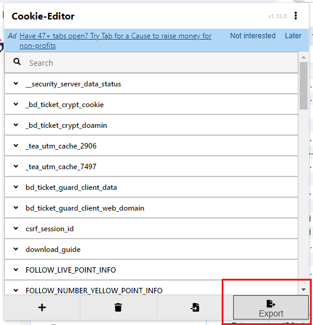
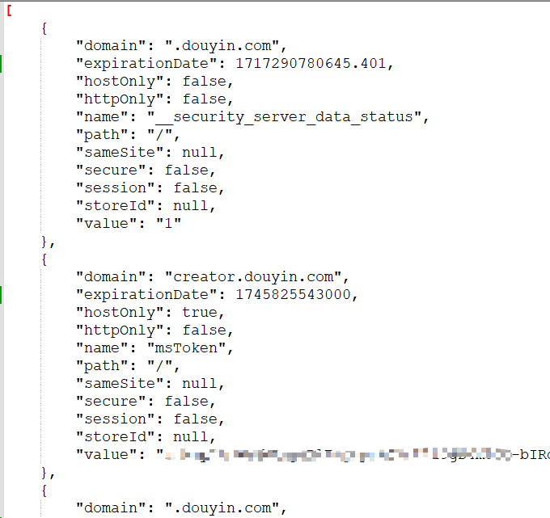

# DouYin-Upload
模拟抖音视频上传（Java版）

准备工作：

- 获取登录后的cookie
- chromeDriver启动后将cookie设置进去，实现免登录
- 自动化操作实现本地视频上传至抖音平台

> 获取cookie

可用插件cookie-editor（网上能搜到）直接导出登录后的cookie

做成一个配置文件：json数组字符串

> 后续逻辑

启动chromeDriver后就读取cookie文件设置cookie，实现免登录，后续就正常模拟上传步骤即可